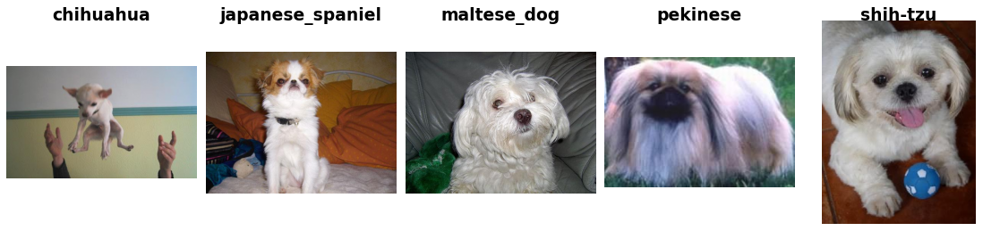

Stanford Dogs
=============

.. raw:: html

   

   
   
   
   

Overview
--------
The Stanford Dogs dataset contains 20,580 images of 120 dog breeds, drawn from ImageNet and curated for fine-grained image classification. Each breed corresponds to one ImageNet synset (e.g. ``n02085620-Chihuahua``) and has roughly 150-250 images. The dataset ships with an official train/test split published in the original paper: 12,000 training images (100 per class) and 8,580 test images. Image resolutions vary across samples. No resizing is applied by default.

- **Train**: 12,000 images
- **Test**: 8,580 images

Data Structure
--------------

When accessing an example using ``ds[i]``, you will receive a dictionary with the following keys:

.. list-table::
   :header-rows: 1
   :widths: 20 20 60

   * - Key
     - Type
     - Description
   * - ``image``
     - ``PIL.Image.Image``
     - H×W×3 RGB image
   * - ``label``
     - int
     - Breed label (0-119)

Usage Example
-------------

**Basic Usage**

.. code-block:: python

    from stable_datasets.images.stanford_dogs import StanfordDogs

    # First run will download + prepare cache, then return the split as a HF Dataset
    ds = StanfordDogs(split="train")

    # If you omit the split (split=None), you get a DatasetDict with all available splits
    ds_all = StanfordDogs(split=None)

    sample = ds[0]
    print(sample.keys())  # {"image", "label"}
    print(ds.features["label"].int2str(sample["label"]))  # e.g. "chihuahua"

    # Optional: make it PyTorch-friendly
    ds_torch = ds.with_format("torch")

References
----------

- Official website: http://vision.stanford.edu/aditya86/ImageNetDogs/
- License: For non-commercial research and educational purposes only

Citation
--------

.. code-block:: bibtex

    @inproceedings{KhoslaYaoJayadevaprakashFeiFei_FGVC2011,
      author    = {Aditya Khosla and Nityananda Jayadevaprakash and Bangpeng Yao and Li Fei-Fei},
      title     = {Novel Dataset for Fine-Grained Image Categorization},
      booktitle = {First Workshop on Fine-Grained Visual Categorization, IEEE Conference on Computer Vision and Pattern Recognition},
      year      = {2011},
      month     = {June},
      address   = {Colorado Springs, CO}
    }
