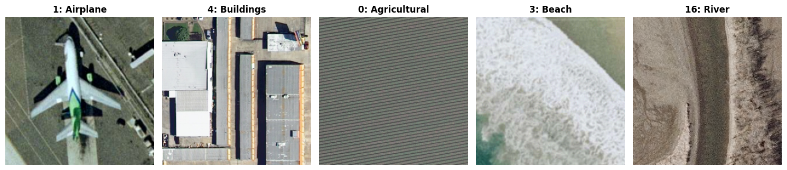

UC Merced
=========

.. raw:: html

   

   
   
   
   

Overview
--------

The UC Merced Land Use Dataset is a remote sensing image classification benchmark consisting of 2,100 aerial images extracted from the USGS National Map Urban Area Imagery collection. It covers 21 land use classes (such as *agricultural*, *airplane*, *forest*, *intersection*) with 100 images per class. The images have a resolution of one foot per pixel.

- **Train**: 2,100 images (100 per class)

.. note::
   This dataset does not define an official train/test split. All images are provided in the ``train`` split. Users are encouraged to perform random splitting or cross-validation.

Data Structure
--------------

When accessing an example using ``ds[i]``, you will receive a dictionary with the following keys:

.. list-table::
   :header-rows: 1
   :widths: 20 20 60

   * - Key
     - Type
     - Description
   * - ``image``
     - ``PIL.Image.Image``
     - 256×256 RGB aerial image
   * - ``label``
     - int
     - Class label (0-20)

Usage Example
-------------

**Basic Usage**

.. code-block:: python

    from stable_datasets.images.uc_merced import UCMerced

    # First run will download + prepare cache, then return the split as a HF Dataset
    ds_train = UCMerced(split="train")

    # Since there is no official test split, you can create one manually:
    ds_split = ds_train.train_test_split(test_size=0.2, seed=42)
    ds_train = ds_split["train"]
    ds_test = ds_split["test"]

    sample = ds_train[0]
    print(sample.keys())  # {"image", "label"}
    print(f"Label: {sample['label']}") # e.g., 0 (Agricultural)

    # Optional: make it PyTorch-friendly
    ds_train_torch = ds_train.with_format("torch")

References
----------

- Official website: http://weegee.vision.ucmerced.edu/datasets/landuse.html

Citation
--------

.. code-block:: bibtex

    @inproceedings{yang2010bag,
      title={Bag-of-visual-words and spatial extensions for land-use classification},
      author={Yang, Yi and Newsam, Shawn},
      booktitle={Proceedings of the 18th SIGSPATIAL International Conference on Advances in Geographic Information Systems},
      pages={270--279},
      year={2010}
    }